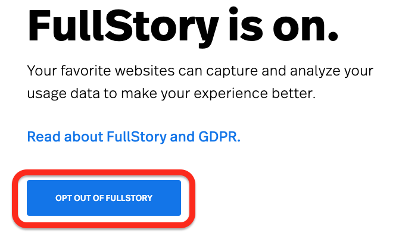
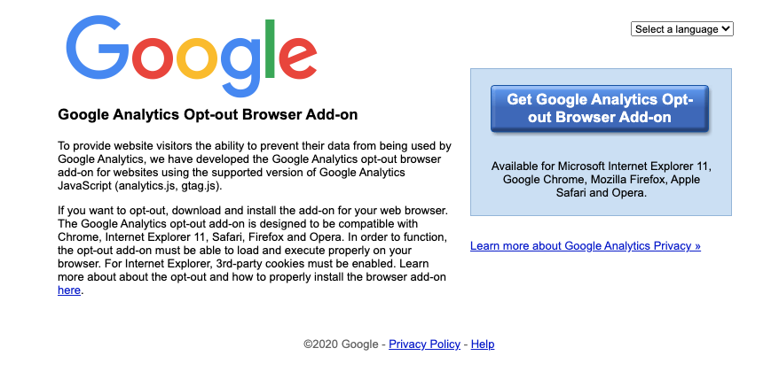

# Analytics & Data Policy
Relay automatically collects data about how you use the service. We want you to understand why we collect data, what data we collect, and how we protect it to determine whether Relay is a product you want to use. 

If you have questions or want to talk to a real person, email us at <hello@relay.sh>. 

## Why do you collect data at all?
Our purpose is to make creating automation suck less–to make the process of creating automation not just possible for a greater number of people, but–well, enjoyable. We deeply care about building thoughtful products that fulfill this promise. To that end, we want to create the best experience possible for you as a user, both in the product itself and when you’re looking for help. 

The problem is that creating the best experience tomorrow requires us to know what sucks about using the product today. We collect data to understand what’s great, what’s not great, and how to best support you. 

## Hold up. Isn’t analytics software the purview of privacy death dealers? 
It’s no secret that analytics data can be abused. It’s very important to us that we treat this data carefully and sensitively. We won’t ever share or sell your data to 3rd party services. We don’t support ads on our service nor do we allow behavior targeting. We won’t use it beyond the uses described here. Furthermore, we’ll collect the minimum amount of information possible and provide proper safeguards for both protecting the data itself and access to it. 

*To put it more bluntly, Relay is the product, not you.*
## How does sharing this data benefit you (the user)?
We exclusively use the collected data to provide better support and improve the product by identifying issues that users are running into when using the product. That’s it. 
## What data does Relay collect? 
Relay collects the following data when you’re using the product:
- User's name and company
- Usage events within the Relay website and application
- User session replay data
- User's locale
- Operating system and browser
- IP address and associated geographic information
- Workflow events
- Workflow logs

Information we collect is limited to the relay.sh domain and we don’t collect your data cross site (aka when you change tabs, we can’t gather any more data). 
## How do you control access to this data? 
We follow a strict set of internal policies about who can access this data and what they can do with it. We limit access to the set of employees who support the core Relay product and provide customer support. 
## How do you safeguard this data? 
We start by excluding sensitive information, including secrets or connection information, from data collection. The external analytics vendors we use each have strong, industry-standard attestations (specifically SOC2) about their data retention and access policies:

- Intercom's data security policies are [available here](https://www.intercom.com/security)
- FullStory's data security policies are [available here](https://help.fullstory.com/hc/en-us/articles/360020624254-Security-Overview)

For the data we collect ourselves, Relay uses Google Cloud Platform (GCP) for its backend service and stores unencrypted data in GCP database products: Redis, Cloud SQL, and Google Cloud Storage.

Encrypted data is stored in Hashicorp Vault, which is configured to have a write-only trust relationship with the user-facing APIs; once encrypted, data can only be deleted or replaced and not read.
## What about sensitive data I put into the system, like tokens or credentials?
This data is encrypted and stored in Hashicorp Vault, as described above. We also prevent this data from being incidentally collected in session replays or other analytics. It is inaccessible to us and never visible or transmitted in a recordable fashion.
## Opting out 
If you would still like to use Relay, but not provide usage information, you can opt out using the following instructions.

### FullStory
If you would like to opt out of Full Story, [click here](https://www.fullstory.com/optout/).

### Google Analytics
You can opt-out of Google Analytics by visiting the [Google Analytics opt-out page](https://tools.google.com/dlpage/gaoptout) and installing the add-on for your specific browser.

