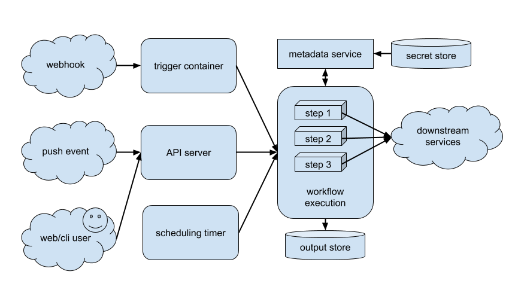

## How Relay Works

If you've read through the [website](https://relay.sh) and followed the [Getting Started guide](getting-started.md), you might be thinking: "This is pertty cool, but how does it _actually work_ under the hood?" This document is aimed at answering that question at a middle-altitude level of technical depth. You'll have a better understanding of the architecture of the Relay service and how the pieces fit together, as a prelude to diving into the [reference documentation](reference.md) or beginning to build [a custom Relay integration](integrating-with-relay.md).

## Definitions

While we've tried to keep the tool-specific jargon to a minimum, there are inevitably some terms that have specific meanings in the context of the Relay system. Here are definitions for the most common ones:

* **Steps** - Relay runs steps, passing in parameters and secrets, as part of an automation workflow.
* **Triggers** - External systems send data to Relay, which handles them by executing a Trigger. The code inside the Trigger determines how to respond to the event.
* **Workflow** - a collection of triggers, sequenced steps, parameters, and metadata that's meant to accomplish a particular task.
* **Event** - a message sent into the Relay service by a Trigger to start running a workflow.
* **Integration** - Collection of step and trigger container definitions that all work with a common service or tool, such as PagerDuty, Slack, AWS EC2, Terraform.
* **Connection** - An authentication instance to a service, such as an API token, security credential, username/password combo, etc. You can create multiple connections of the same kind– each differentiated by a user-friendly name. Examples include Slack accounts, AWS accounts, GitHub accounts, etc.

## Architectural Overview

At its heart, Relay is a system for running workflows, which are ordered series of container executions, in response to events, which are messages that come in to the system from the outside world.

Let's walk through the lifecycle of a workflow run, following this block architecture diagram. (Note this is not an exhaustive picture of the system; we're glossing over some systems like authentication, queuing, and storage to focus on the parts user workflows interact with the most.)

## Events and Triggers

A workflow run begins with an event, which can come from a few distinct sources.

If you've defined a [webhook trigger](reference/relay-workflows.md#webhook) on your workflow, Relay builds a unique URL for the remote service to call back on. In response to an incoming webhook payload, Relay executes a container defined in the workflow and dispatches the payload to it. The container's job is to decide whether to act on the webhook event and, if so, to dispatch an event back to the API to start the workflow.

The API server also receives events from [push triggers](reference/relay-workflows.md#push) in addition to CLI and web app interactions where a user initiates the workflow run directly. If your workflow uses a push trigger, Relay generates a JWT authentication token that's uniquely associated with that workflow. For interactive runs, the user is responsible for providing parameter values, whereas triggers use the [`!Data` function](reference/relay-functions.md#data) to bind data from the incoming message to workflow parameter values.

There's also support for scheduled triggers, which generate an event at [crontab-style time intervals](reference/relay-workflows.md#schedule). This provides a simple, useful way to run a workflow on a recurring basis, with the drawback that you can't provide dynamic data into the workflow.

## Workflow execution

Workflows are written in YAML, which Relay interprets and stores on the service. Workflow files define both the triggers which activate them and the steps that ought to run to get the work done. Workflows are also parameterized, to make them more flexible. Workflows run on Kubernetes using [Tekton pipelines](https://tekton.dev) to manage ordering, lifecycle, and error handling.

An important part of each `step` definition in a workflow is its `spec`, short for "specification". This is a map of keys and values which Relay's metadata service makes available to the step container's runtime. A spec can contain a mixture of parameter values, computed strings (for example, using the [`!Fn.concat` function](reference/relay-functions.md#concat)), and secrets. The most important thing to note is that data won't be visible to the step container without being enumerated in the spec. A step may publish a `spec` definition, in the form of a JSON Schema, that forms its API contract with a workflow.

As each step runs, it modifies the outside world by communicating with downstream tools and services. This frequently requires authentication credentials and secrets, which Relay stores in HashiCorp Vault and makes available (through the spec) to steps which need them. For more on the internals of secret storage and retrieval, check out the [Implementation details section of the Secret reference](using-workflows/adding-secrets#implementation-details).

Steps also emit log output back to the service, including errors and failures. The failure of any step (indicated by a non-zero exit code from its entrypoint) will cause the workflow run to stop, allowing any currently executing steps to complete and causing any further pending steps to be skipped. The log output is stored in the service for historical auditing and troubleshooting.

## Security

### Where and how is my data stored?

Relay uses Google Cloud Platform for its backend service and stores data encrypted-at-rest in Google Cloud SQL and Google Cloud Storage. Sensitive data is stored in HashiCorp Vault, which is configured to have a write-only trust relationship with the user-facing APIs; once encrypted, data can only be deleted or replaced and not read. Behind the scenes, a Kubernetes controller manages grants to the underlying Vault service so secrets can be used in workflows.

### How do you keep Relay secure?

Your security and privacy is a top priority for us. We:

* conform to regulatory requirements for personally-identifable information (PII)
* manage an escalation policy for outages and incidents, including security incidents
* force HTTPS on all connections
* enforce access control on our microservice infrastructure
* encrypt user secrets and credentials and hash passwords with salts
* regularly update our code dependencies and runtime environment to keep up with security patches
* audit logs for suspicious activity

### What data does Relay store?

Relay stores:

* user account information
* web activity usage via Fullstory
* user-provided credentials and secrets
* audit history and step execution output

### Can I host Relay on-prem?

No, at the moment Relay is SaaS-only. We are actively exploring feasibility of adding an on-prem connector but will not be likely to provide a self-hosted version of the product. Please [contact us](mailto:relay@puppet.com) if you're interested in working with us on defining requirements for this capability.

## Further reading

In addition to the inline links above, if you're interested in deeper internals of the system, please read the [Integrating with Relay](integrationg-with-relay.md) doc, the [reference section](reference.md), and check out the [technical blog](https://relay.sh/).