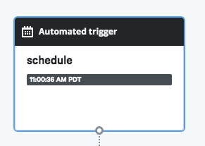

# Adding Triggers to Workflows

## Overview

Triggers in Relay cause workflows to be run. They come in several flavors. In order of increasing sophistication, they are:

* **Schedule triggers** - Relay includes a `cron` style service which can trigger workflows on a time-based schedule.
* **Push triggers** - External systems can send events to a Relay API endpoint with a workflow-specific authentication token, causing their associated workflow to run.
* **Webhook triggers** - Relay supports external services that implement webhook callbacks. It generates a unique URL to which the external service POSTs a payload; Relay then runs a user-defined container to handle the request.

The [Workflow reference guide](../reference/relay-workflows.md#triggers) defines the syntax for triggers. This guide shows how to use each kind in conjunction with an external system and how to set them up on your Relay account.

All varieties of triggers are defined in a top-level `triggers:` section of your workflow YAML. The value of `triggers:` is a list of maps, each of which is a separate trigger that will cause the workflow to run. A single workflow can have multiple triggers to accomodate different event sources.

Every trigger definition needs a `name` field and a `source` map that specifies the `type` of trigger it is.  Currently `schedule`, `webhook`, and `push` are the only valid values for `type`. Which additional fields are needed depends on the `type`.

Trigger definitions also need a [`binding`](../reference/relay-workflows.md#binding), a map whose keys are the names of parameters the workflow requires. The values can come from the event payload, extracted using the [`!Data` custom type](../reference/relay-types.md#data). This allows you to dynamically inject from the trigger into the workflow.

## Schedule triggers

Relay has an internal scheduling service that will kick off workflow runs on time-based schedules - think of it as a fancy cloud-based `crontab`. A schedule trigger has the simplest definition, because it just adds a cron format `schedule` key to the `source` map that defines the trigger:

```yaml
triggers:
- name: my-schedule-trigger
  source:
    type: schedule
    schedule: '7-57/10 * * * *'
```

This schedule will run the workflow every ten minutes, starting at 7 minutes past the hour (:07, :27, :37, :47, :57). Unless you have specific time-sensitive requirements, it's a good idea to use a slightly irregular schedule so everything doesn't kick off exactly on the top of the hour, to avoid a [thundering herd problem](https://en.wikipedia.org/wiki/Thundering_herd_problem).

Schedule triggers will show up in the web app as the first, topmost node in the dependency graph:



## Push triggers

Push triggers allow you to send events to a Relay API endpoint to start a workflow. If you have an external system which can POST simple HTTP payloads, push triggers can be a great low-friction way to start sending events into Relay. Another advantage of push triggers is that Relay generates a workflow-specific [JSON web token](https://jwt.io/), or JWT, which allows you to securely connect external systems without providing your Relay login credentials.

To add a push token to your workflow, configure a `trigger` section like this:

```yaml
triggers:
- name: my-push-trigger
  source:
    type: push
```

When you save this workflow through the web editor or visit its page in the web app if you've updated it via CLI, you'll be presented with the authentication token under the "Settings" sidebar.


Use this token to authenticate your HTTP requests to `api.relay.sh/api/events` with an `Authorization: Bearer <TOKEN>` header. The payload of the request should be a JSON document with a single top-level key named `data`; its values are the fields you'll extract in the `binding` section of the trigger definition. For example, a curl command would look like:

```shell
export TOKEN=... # get this from the web app
curl -X POST -H "Authorization: Bearer $TOKEN" \
   -d '{"data": {"message": "This is a push event"}}' \
   https://api.relay.sh/api/events
```

## Webhook triggers

