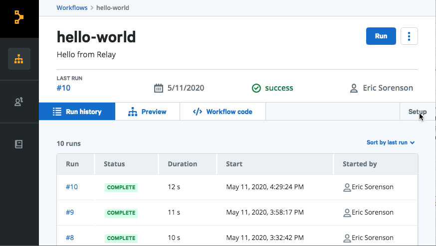

# Managing secrets

Encrypted secrets allow you to store sensitive information in Relay and make it available to steps during your workflow run.

## Adding secrets

Add a secret to your workflow and then use Relay's web interface to store the content of the secret securely. Secrets are scoped to a single workflow. To add secrets, you must be have the Operator, Approver, or Administrator role.

To set a value for the secret, on the workflow's page, go to the **Settings** page under **Configuration**, then click **Add secret**. Make sure the name you provide matches the name of the field in the workflow! Once you create a secret, you cannot view its value again. You can only overwrite or delete it.

The value you set for a secret must be a string. If you have multiple key-value pairs to pass in to the secret, or your secret is the contents of a file, you must encode the values using base64 encoding, and use the encoded string as the secret value.



## Using secrets

To add a secret to your workflow, use the `secrets` key in a template expression with the sceret's name. For example:

```yaml
steps:
- name: use-a-secret
  image: relaysh/core
  spec:
    credentials: ${secrets.credentials}
```

When workflows run, steps that require a secret request the secret value from the Relay secrets service. Inside a step, the `ni` command-line tool or SDKs can access secret values like regular values:

```
USERNAME="${USERNAME:-$(ni get -p '{.username}')}"
PASSWORD="${PASSWORD:-$(ni get -p '{.credentials}')}"
```

## Implementation details

Relay secrets and [connections](../using-workflows/managing-connections.md) have similar implementations. Relay encrypts secrets when you create them and stores the encrypted secrets in a secure service backed by [HashiCorp Vault](https://www.vaultproject.io). The permissions between Relay's services are set up so the user-facing APIs and the web app can create, overwrite, or delete, but never display secrets. The service which provides metadata to workflow runs can view but not change secrets, so they're visible to the containers as workflows execute.

There are some important differences between secrets and connections.
* Secrets are scoped to a workflow and no other workflow can access another workflow's secrets, whereas connections are reusable across workflows.
* Secrets consist of a single string key-value pair, which can be named anything that makes sense for the workflow which uses them. Connections can have a user-specified name, but a connection's structure is always consistent, to enable reuse. For example, an `aws` connection will always have an `accessKeyID` field, whereas an `azure` connection will always have a `subscriptionID`.

As any step can request secrets, it pays to be cautious:
- Be extra careful when printing output in steps which use secrets. Steps have plaintext access to secrets and credentials, so `echo` or `printf` debugging steps can accidentally leak their values.
- When creating credentials to access an external service, grant the minimum necessary credentials for the workflow to run.
- Because the contents will be encrypted, it helps to make meaningful names for connections which indicate which account or role they are associated with.
- Use service accounts over personal credentials where possible.
- Understand the code for every step running in the workflow. Source code for Puppet-curated containers lives in the [Relay integrations organization](https://github.com/relay-integrations)