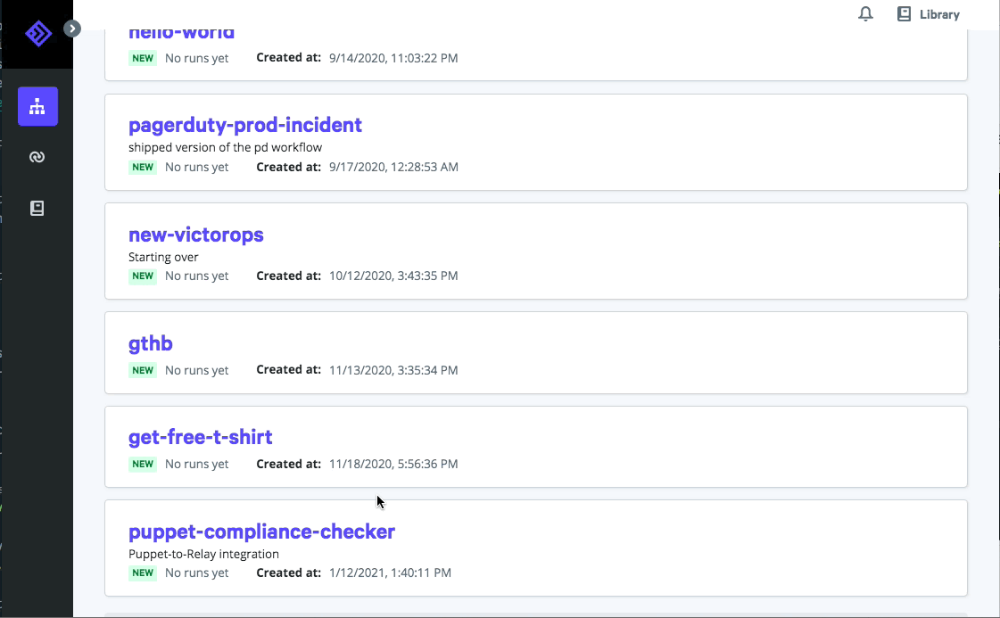

# Running a workflow

- To run workflows, user must be Operator, Approver, or Administrator.

## Running from the web
Run a workflow from Relay's web interface, or use the CLI.

To run a workflow from the web app, navigate to the workflow's page and click the "Run" button in the top right. Relay will prompt you for any required parameters and then launch the run.



## Running from CLI

Log in from the command line, then run a workflow by specifying its name and any required parameters:

```
relay auth login me@relay.sh 
relay workflow run hello-world -p message="Hello"
```

