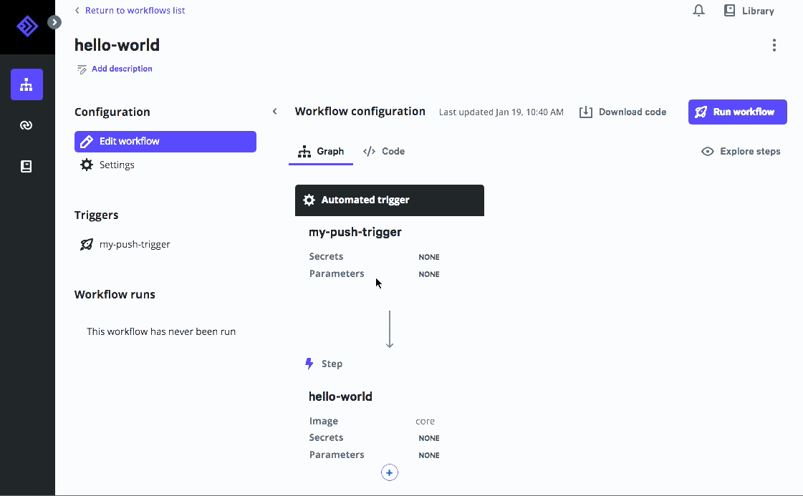
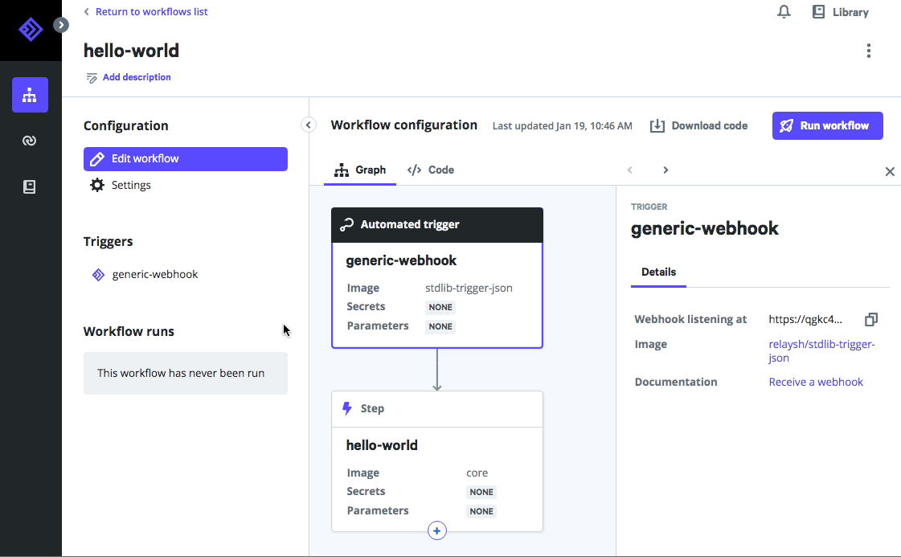

# Using triggers in workflows

## Overview

Triggers in Relay cause workflows to be run. They come in several flavors. In order of increasing sophistication, they are:

* **Schedule triggers** - Relay includes a `cron` style service which can trigger workflows on a time-based schedule.
* **Push triggers** - External systems can send events to a Relay API endpoint with a workflow-specific authentication token, causing their associated workflow to run.
* **Webhook triggers** - Relay supports external services that implement webhook callbacks. It generates a unique URL to which the external service POSTs a payload; Relay then runs a user-defined container to handle the request.

The [Workflow reference guide](../reference/relay-workflows.md#triggers) defines the syntax for triggers. This guide shows how to use each kind in conjunction with an external system and how to set them up on your Relay account.

All varieties of triggers are defined in a top-level `triggers:` section of your workflow YAML. The value of `triggers:` is a list of maps, each of which is a separate trigger that will cause the workflow to run. A single workflow can have multiple triggers to accomodate different event sources.

Every trigger definition needs a `name` field and a `source` map that specifies the `type` of trigger it is.  Currently `schedule`, `webhook`, and `push` are the only valid values for `type`. Which additional fields are needed depends on the `type`.

Trigger definitions also need a [`binding`](../reference/relay-workflows.md#binding), a map whose keys are the names of parameters the workflow requires. The values can come from the event payload, extracted using the [`!Data` custom type](../reference/relay-types.md#data). This allows you to dynamically inject from the trigger into the workflow.

## Schedule triggers

Relay has an internal scheduling service that will kick off workflow runs on time-based schedules - think of it as a fancy cloud-based `crontab`. A schedule trigger has the simplest definition, because it just adds a cron format `schedule` key to the `source` map that defines the trigger:

```yaml
triggers:
- name: my-schedule-trigger
  source:
    type: schedule
    schedule: '7-57/10 * * * *'
```

This schedule will run the workflow every ten minutes, starting at 7 minutes past the hour (:07, :27, :37, :47, :57). Unless you have specific time-sensitive requirements, it's a good idea to use a slightly irregular schedule so everything doesn't kick off exactly on the top of the hour, to avoid a [thundering herd problem](https://en.wikipedia.org/wiki/Thundering_herd_problem).

Schedule triggers will show up in the web app as the first, topmost node in the dependency graph:


## Push triggers

Push triggers allow you to send events to a Relay API endpoint to start a workflow. If you have an external system which can POST simple HTTP payloads, push triggers can be a great low-friction way to start sending events into Relay. Another advantage of push triggers is that Relay generates a workflow-specific [JSON web token](https://jwt.io/), or JWT, which allows you to securely connect external systems without providing your Relay login credentials.

To add a push token to your workflow, you can use the graphical editor. This will add the correct section to your workflow, then display the authentication token that you can copy-paste into the application that will be sending the trigger.


If you want to add it manually, the code looks like this:

```yaml
triggers:
- name: my-push-trigger
  source:
    type: push
```

If you need to view or copy the JWT again after it's created, it's visible in the **Triggers** section of the workflow's page.



Use this token to authenticate your HTTP requests to `api.relay.sh/api/events` with an `Authorization: Bearer <TOKEN>` header. The payload of the request should be a JSON document with a single top-level key named `data`; its values are the fields you'll extract in the `binding` section of the trigger definition. For example, a curl command would look like:

```shell
export TOKEN=... # get this from the web app
curl -X POST -H "Authorization: Bearer $TOKEN" \
   -d '{"data": {"message": "This is a push event"}}' \
   https://api.relay.sh/api/events
```

## Webhook triggers

Webhooks allow an external service to generate and send messages into Relay. Configuring a webhook has three parts: setting up a `trigger` container image on Relay, incorporating that image into your workflow, and configuring the external service.

Relay will route incoming webhook requests to their associated trigger container. It's the container entrypoint's job to handles the incoming HTTP request and emit an event to the Relay service API to start the workflow itself. The ["Integrating with Relay"](../developers/integrating-with-relay.md#writing-entrypoint-code) documentation has details for writing trigger entrypoints and the [relay-github](https://github.com/relay-integrations/relay-github) integration has a great working example of a webhook trigger container.

Once you've found or created a trigger container, you'll need to reference it in your workflow's `triggers` section. The `source` map should set `type: webhook` and contain an `image` field, whose value is the registry path to the container image. As with `push` triggers, the trigger definition also needs a `binding` section to map the output from entrypoint's API event onto workflow parameters.

The flow of data through the system is the trickiest part of webhooks. Walking through it end-to-end:

* The container entrypoint parses and extracts data from the webhook payload.
* If the data pass validation and the workflow ought to run, the entrypoint code creates a Relay event. An event is a data structure whose field names and values Relay's service API makes available to the workflow.
* The workflow trigger definition's `binding` section maps the content of the event to workflow parameters. The keys inside the binding are the names of the parameters and the values use `!Data <fieldname>` to extract data from the event.
* These parameter values are then available in the `spec` section for individual steps, the same as if the workflow were run manually.

When you add a webhook trigger to a workflow, the workflow's page in the Relay web app will display the automatically-generated URL for the external system to call. Each external system will have its own way to configure sending the webhook, but here's an example using [this GitOps workflow](https://github.com/puppetlabs/relay-workflows/tree/master/update-workflow-on-merge) to update workflows stored on the service whenever a PR merge updates them on Github.

Go to the **Triggers** section of a workflow's page to display the URL for a webhook trigger and to view logs from incoming webhook events:



On the GitHub repository, the webhook configuration is under Settings - Webhooks. For GitHub specifically, there's the option to filter down the kinds of repository events which will call the webhook; for this workflow, only "Pull request" events make sense, so we've enabled only those events. Other services may not be as configurable, in which case the webhook entrypoint code can encode the logic to determine whether to activate the workflow. Alternately, you can use [`when` conditions](../reference/relay-workflows.md#when) in the workflow itself; this option is helpful if you're using a community-maintained webhook image that shouldn't contain your site-specific logic. See the [documentation on conditionals](../using-workflows/conditionals.md) for details on `when` conditions.


After saving that configuration, pull request activity sends [a pull_request payload](https://developer.github.com/webhooks/event-payloads/#pull_request) to the [relaysh/github-trigger-pull-request-merged](https://hub.docker.com/r/relaysh/gitlab-trigger-merge-request-merged) container, which runs [the container's entrypoint handler code](https://github.com/relay-integrations/relay-github/blob/master/triggers/github-trigger-pull-request-merged/handler.py). The handler creates a Relay event if the code passes validation, extracting details about the PR from the payload and mapping them to the workflow's parameters. The workflow itself has a single step that uses the `relaysh/core` container image with a small inline shell script, to clone the repo and update the version of the workflow that's stored on Relay with the new version of the code from the PR.
